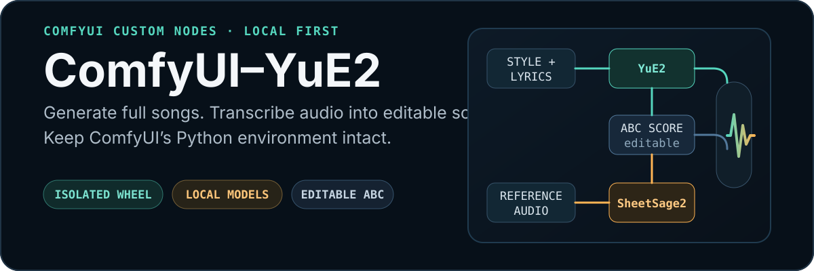

<p align="center">
  
</p>

<p align="center">
  <strong>Generate complete 48 kHz songs, extract editable ABC scores from reference audio, and build cover workflows without downgrading ComfyUI.</strong>
</p>

<p align="center">
  <a href="#quick-start">Quick start</a> ·
  <a href="#model-layout">Models</a> ·
  <a href="#nodes">Nodes</a> ·
  <a href="#what-this-fork-fixes">Fork fixes</a>
</p>

## Update — 2026-09-23

- Added Native ComfyUI pipeline support alongside Legacy/HF.
- Added YuE2 Universal Adapter Loader (LoRA / LoKr) for Native and Legacy workflows.
- Added automatic support for FL-YuE2, Starnodes, ComfyUI-native, PEFT/HF, HOT-Step, LoKr and Mothersuperior YuE2 adapters.
- Added adapter stacking with independent AR/NAR strengths.
- Added in-node help and clearer FL-specific loader names.
- Updated bundled workflows to use the Universal Adapter Loader by default.

Updated: 2026-09-23

## What this is

**ComfyUI-YuE2** is now a native extension layer for ComfyUI's built-in YuE2 support:

- **Comfy-Org YuE2 checkpoints** load from `models/checkpoints/` as standard `MODEL`, `CLIP`, and `VAE` objects. Both the BF16 and INT8 ConvRot checkpoints are supported.
- **Comfy-Org SheetSage2** loads from `models/audio_encoders/` as a standard `AUDIO_ENCODER`.
- **`YUE2_NATIVE_PIPE`** is a lightweight bundle of those same native objects. The loader also exposes every standard output for stock ComfyUI nodes.
- The fork's ABC editing, vocal-range, melody-cleanup, prompt, lyrics, MIDI, and analysis nodes connect directly to ComfyUI's official YuE2 nodes.

The native pipe is only a Python container; it does not install `yue2_infer`, create a separate model runtime, or require a second copy of the weights. The earlier isolated Hugging Face runtime remains available under **Legacy HF Runtime** only so existing workflows do not break.

> **Fork notice:** This repository is a compatibility-focused fork of
> [`piscesbody/ComfyUI-YuE2`](https://github.com/piscesbody/ComfyUI-YuE2),
> updated for native ComfyUI YuE2, INT8 checkpoints, editable ABC workflows,
> dependency-safe installation, and an English interface.

## Workflows

| Goal | Native node path | Reference audio |
| --- | --- | --- |
| Generate a new song | `YuE2 Native Pipeline Loader` → `YuE2 Native Generate ABC` → ABC tools → `YuE2 Native Generate Music` → standard sampler/VAE nodes | Not required |
| Generate directly without a score | Native pipe → `YuE2 Native Generate Music` with empty ABC → standard sampler/VAE nodes | Not required |
| Create a cover or remix | Native pipe → `YuE2 Native Audio to ABC` → ABC tools → `YuE2 Native Generate Music` → standard sampler/VAE nodes | Required |
| Analyze or edit a score | Any ABC string → analyzer/modifier/cleanup/range/file nodes | Not required |

For covers, SheetSage2 extracts a symbolic score. YuE2 creates a new recording from that score, the target style, and the lyrics. This is not voice cloning and does not preserve the source waveform.

## What this fork fixes

- **Native ComfyUI + INT8 support** -&#x20; uses Comfy-Org single-file checkpoints
  and standard `MODEL`, `CLIP`, `VAE`, and `AUDIO_ENCODER` types.
- **No duplicate model installation** -&#x20; native workflows reuse the same files
  as ComfyUI's official YuE2 workflows.
- **Editable native score path** -&#x20; the ABC tools sit directly between the
  official planning, SheetSage2, and music-conditioning nodes.

The following fixes remain available for old workflows under **Legacy HF Runtime**:

- **Dependency-safe YuE2 runtime** -&#x20; extracts the pure-Python `yue2_infer` wheel into a node-private runtime instead of allowing pip to downgrade Torch, Transformers, NumPy, or Hugging Face Hub.
- **Modern Transformers compatibility** -&#x20; adapts legacy Transformers 4.x model APIs to current Transformers 5.x behavior.
- **SheetSage2 tied weights** -&#x20; recognizes the intentionally shared decoder and output embeddings instead of rejecting the adapter checkpoint as incomplete.
- **Correct MERT2 rotary embeddings** -&#x20; repairs corrupted `inv_freq` buffers that can otherwise produce rhythm and chords without reliable melody pitch.
- **Fully local MERT2 loading** -&#x20; loads the parent encoder from `models/MERT2/` without copying model code into the global Hugging Face modules cache.
- **Windows attention fallback** -&#x20; detects unavailable built-in Flash Attention and switches GraphAR to the cuDNN SDPA backend.
- **ComfyUI runtime isolation** -&#x20; restores process-wide CUDA memory limits and precision flags after YuE2 uses them.
- **Legacy workflow migration** -&#x20; accepts old workflows that stored `vae_decode=false` and maps the value to `tiled`.

## Quick start

### 1. Update ComfyUI

Native YuE2 requires a current ComfyUI containing `YuE2 Generate ABC`, `YuE2 Generate Music`, `Empty YuE2 Latent Audio`, and `SheetSage2 Audio to ABC`.

### 2. Install this node

Clone or copy the repository into `ComfyUI/custom_nodes/ComfyUI-YuE2`, then restart ComfyUI. Native mode has no additional pip dependencies:

```powershell
python_embeded\python.exe -m pip install -r ComfyUI\custom_nodes\ComfyUI-YuE2\requirements.txt
```

The command is intentionally a no-op dependency file. Do not pip-install the upstream `yue2_infer` wheel.

### 3. Download the native models

Use the Comfy-Org single-file checkpoints shown below. You do not need the separate `YuE2-3B`, `YuE2-Vae`, `SheetSage2`, or `MERT-v2-FullSong` directories for native workflows.

## Model layout

```text
ComfyUI/models/
checkpoints/
|-- yue2_3b_int8_convrot.safetensors   # recommended
`-- yue2_3b_bf16.safetensors           # optional
audio_encoders/
`-- sheetsage2_bf16.safetensors         # reference/cover workflows
```

| File | Source |
| --- | --- |
| `checkpoints/yue2_3b_int8_convrot.safetensors` | [`Comfy-Org/YuE2`](https://huggingface.co/Comfy-Org/YuE2/tree/main/checkpoints) |
| `checkpoints/yue2_3b_bf16.safetensors` | [`Comfy-Org/YuE2`](https://huggingface.co/Comfy-Org/YuE2/tree/main/checkpoints) |
| `audio_encoders/sheetsage2_bf16.safetensors` | [`Comfy-Org/YuE2`](https://huggingface.co/Comfy-Org/YuE2/tree/main/audio_encoders) |

The INT8 checkpoint contains the native YuE2 model, text/planning model, tokenizer, and VAE in one ComfyUI checkpoint. The native SheetSage2 file already contains its required audio encoder, so it does not download the separate 3.7 GB MERT2 parent.

<details>
<summary>Legacy Hugging Face model layout</summary>

Old workflows using nodes labelled `(Legacy HF)` may still use `models/YuE2/`, `models/SheetSage2/`, and `models/MERT2/`. Those files are not needed by the native workflows. Optional legacy dependencies are listed in `requirements-legacy.txt`.

The legacy SheetSage2 loader uses `local_only` by default: it checks
`models/MERT2/` and an existing Hugging Face cache, but never starts a MERT2
download automatically. Network download is available only through the explicit
`allow_huggingface_download` option. Native workflows need only the combined
`models/audio_encoders/sheetsage2_bf16.safetensors` file.

</details>

### Custom model paths

```yaml
yue2_native:
  base_path: F:/models
  checkpoints: checkpoints/
  audio_encoders: audio_encoders/
```

## First generation

1. Load `yue2_3b_int8_convrot.safetensors` with **YuE2 Native Pipeline Loader (ComfyUI)**.
2. Connect its `pipe` output to the native generation nodes, or use its standard outputs with stock ComfyUI nodes.
3. Add **YuE2 Native Generate ABC** when you want an editable score.
4. Insert any of this fork's ABC nodes between **YuE2 Native Generate ABC** and **YuE2 Native Generate Music**.
5. Use `full` for melody plus chords, `melody` for a melody-only cover plan, or leave ABC empty for direct generation.

Importable native workflows:

- [`YuE2_Native_Text_to_Song.json`](./example_workflows/YuE2_Native_Text_to_Song.json) -&#x20; native pipe generation with style/lyrics helpers, editable ABC, analysis, and the standard sampler/decode path.
- [`YuE2_Native_Reference_Remix.json`](./example_workflows/YuE2_Native_Reference_Remix.json) -&#x20; native SheetSage2 remix with prompt helpers, tempo/range/cleanup tools, and ABC/lyrics analysis.

The previous isolated-runtime workflows remain in the folder for backward compatibility and are now considered legacy.

## Cover workflow

```text
Load Audio
    ↓
YuE2 Native Pipeline Loader (audio_encoder = sheetsage2_bf16)
    ├── native pipe → YuE2 Native Audio to ABC / Generate Music
    └── MODEL / CLIP / VAE / AUDIO_ENCODER → stock ComfyUI nodes

SheetSage2 ABC
    → ABC Modifier
    → Vocal Range Retarget
    → Melody Cleanup
    → YuE2 Native Generate Music (mode = melody)
```

The custom ABC nodes only transform text, so they work with INT8 and BF16 checkpoints identically. They never depend on the model's weight format.

## Nodes

| Node | Description |
| --- | --- |
| **YuE2 Native Pipeline Loader (ComfyUI)** | Loads official model files and returns a lightweight native pipe plus standard `MODEL`, `CLIP`, `VAE`, and optional `AUDIO_ENCODER` outputs. |
| **YuE2 Native Pipe Components** | Unpacks a native pipe for connection to stock ComfyUI nodes. |
| **YuE2 Native Generate ABC** | Generates an editable ABC plan using the pipe's native CLIP and the stock sampling controls. |
| **YuE2 Native Generate Music** | Returns native conditioning, duration, MODEL, and VAE for the stock sampler/decode path. |
| **YuE2 Native Audio to ABC** | Uses the pipe's native SheetSage2 encoder to transcribe reference audio. |
| **YuE2 Native Models Loader (ComfyUI)** | Backward-compatible standard-output loader for earlier native workflows. |
| **YuE2 ABC Analyzer** | Reports BPM, key, meter, approximate duration, note counts, ranges, medians, and vocal warnings. |
| **YuE2 ABC Modifier** | Overrides or scales BPM, transposes the score or selected voices, shifts octaves, removes chords, and trims sections. |
| **YuE2 Vocal Range Retarget** | Applies an octave-safe Vocal shift toward common male/female ranges, or a manual shift. |
| **YuE2 Melody Cleanup** | Replaces suspiciously short or extreme Vocal notes with equal-duration rests while preserving timing. |
| **YuE2 ABC File Loader / Saver** | Loads editable `.abc` files from input or saves them under output. |
| **YuE2 MIDI File Saver** | Saves legacy SheetSage2 MIDI output. |
| **YuE2 Style Prompt Builder** | Builds a compact style prompt from language, genre, era, vocal, instruments, drums, mood, and tempo. |
| **YuE2 Lyrics / Melody Fit Analyzer** | Compares estimated syllables with Vocal note counts per section. |
| **YuE2 Lyrics Formatter (Timed to Sections)** | Converts LRC, SRT, or aligned timed text into sectioned lyrics. |
| **YuE2 Lyrics Structurer (Text to Sections)** | Adds and distributes section tags across plain lyrics. |
| **YuE2 Lyrics File Loader (LRC/SRT)** | Reads lyric files from the ComfyUI input directory. |

Nodes labelled **Legacy HF** are retained for saved-workflow compatibility. They use the old isolated pipeline and are not required for the native INT8/BF16 workflows.

## Generation controls

Native generation uses ComfyUI's official controls:

| Control | Meaning |
| --- | --- |
| `mode=full` | Generate or use a melody-and-chord ABC plan. |
| `mode=melody` | Use a melody-only plan; recommended for covers and remixes. |
| Empty `abc` | Direct generation (`off` mode internally). |
| `max_duration` | Upper bound for semantic generation; the song may finish earlier. |
| `KSampler steps=32` | Official acoustic midpoint-solver setting. |
| `sampler=dpm_2` / `scheduler=sgm_uniform` | Defaults used by the official ComfyUI workflows. |
| `cfg=1.0` | Native single-pass acoustic decoding. |

`ABC Modifier`, `Vocal Range Retarget`, and `Melody Cleanup` run before semantic generation and are independent of INT8/BF16 model precision.

### Legacy SheetSage2 ABC recovery

`strict` remains the default and preserves upstream behavior. If melody-only
ABC export fails on a decoded note that cannot be represented on the sub-beat
grid, the other policies preserve the completed transcription:

- `snap_invalid_notes` builds a conservative 1/32-grid score from returned MIDI;
- `skip_invalid_notes` does the same but drops overlapping/invalid notes;
- `fallback_full` retries the upstream full score with harmony;
- `return_midi_only` returns MIDI and structure without requiring ABC.

Recovered MIDI-derived ABC intentionally omits chord symbols instead of
inventing harmony. Review it in an ABC editor before an important render.

## Compatibility

The native INT8 path has been exercised on Windows with:

```text
ComfyUI       0.35
Python        3.13
PyTorch       2.11 + CUDA 13.0
GPU           NVIDIA RTX 4090
```

Linux and other compatible NVIDIA GPUs should work, but the full matrix has not been tested. YuE2 requires substantial VRAM and a CUDA GPU with BF16 support is strongly recommended.

## Limitations

- Model files are not included in this repository.
- Legacy HF workflows require a YuE2 wheel matching their selected model release; native workflows do not use the wheel.
- Reference audio is used to extract a symbolic score; it does not clone the original singer.
- Vocal-only non-octave transposition changes the melody's harmonic relationship; octave shifts are the safe automatic default.
- Legacy memory presets are starting points, not guarantees. Native workflows use ComfyUI's normal model management.
- YuE2 model weights are non-commercial. Review every upstream model license before use.
- The legacy `external-flash` option requires a compatible optional `flash-attn` installation; native ComfyUI mode does not require it.

## Credits and license

This repository is derived from
[`piscesbody/ComfyUI-YuE2`](https://github.com/piscesbody/ComfyUI-YuE2) and is
maintained as a compatibility-focused fork. The original node implementation,
model architecture, inference code, and weights belong to their respective
upstream projects:

- [`piscesbody/ComfyUI-YuE2`](https://github.com/piscesbody/ComfyUI-YuE2)
- [`multimodal-art-projection/YuE`](https://github.com/multimodal-art-projection/YuE)
- [`m-a-p/YuE2-3B`](https://huggingface.co/m-a-p/YuE2-3B)
- [`m-a-p/SheetSage2`](https://huggingface.co/m-a-p/SheetSage2)

Node code is distributed under the repository [`LICENSE`](./LICENSE). Model weights and bundled upstream artifacts retain their own licenses; YuE2 weights are released under **CC BY-NC 4.0**.

## YuE2 LoRA / LoKr adapters

For most users, use **YuE2 Universal Adapter Loader (LoRA / LoKr)**. It detects supported YuE2 adapter formats and applies patches to the matching AR and/or NAR branch. Choose the Legacy or Native node that matches your pipeline.

Chain Universal Loader nodes to stack adapters: `Base -> Adapter A -> Adapter B` gives `Base + A + B`. Changing the adapter in one node replaces that node's previous contribution. `ar_strength` affects AR patches and `nar_strength` affects NAR patches; NAR-only adapters ignore `ar_strength`, and AR-only adapters ignore `nar_strength`.

### Legacy and Native

- **Legacy** uses the original YuE2/HF runtime. Adapters are applied request-scoped; this backend remains available for existing workflows.
- **Native** uses ComfyUI `ModelPatcher`. Adapters are applied to cloned patchers, leaving the base model clean. Use it with the newer Native YuE2 pipeline. Neither backend is inherently higher quality.

### Supported adapter formats

| Adapter format | Legacy | Native |
| --- | --- | --- |
| FL-YuE2 | Yes | Yes |
| Starnodes raw `yue2-lora-v1` | Yes | Yes |
| `comfyui-native-lora` | Yes | Yes |
| PEFT/HF YuE2 LoRA | Yes | Yes |
| HOT-Step fused LoRA | Yes | Yes |
| HOT-Step native split | Yes | Yes |
| HOT-Step native-split LoKr | Yes | Yes |
| Mothersuperior YuE2 AR | Yes | Yes |
| Yue2 Studio acoustic | Experimental | Experimental |
| `yue2-artist-ar-v1` | No | No |

The FL-specific **FL-YuE2 LoRA Pair Loader — Legacy** and **FL-YuE2 LoRA Pair Loader — Native** remain available for backward compatibility and for users who specifically want the FL-YuE2 AR/NAR pair format. Use the Universal loader for other formats.

`yue2-artist-ar-v1` is unsupported because its `nar_lora_joint_v4.pt` companion is pinned NAR decoder state, not an ordinary strength-scaled LoRA. HOT-Step LoKr support is for the inference-ready `native_split_v1` export; fused LoKr checkpoint artifacts are not accepted directly. PEFT adapters need an `adapter_config.json` beside the weights and must have YuE2-compatible targets.

### Training tools

- [Starnodes2024/ComfyUI-YuE2-Trainer](https://github.com/Starnodes2024/ComfyUI-YuE2-Trainer)
- [ComfyUI-FL-YuE2](https://github.com/filliptm/ComfyUI-FL-YuE2)
- [HOT-Step-CPP](https://github.com/scragnog/HOT-Step-CPP)
